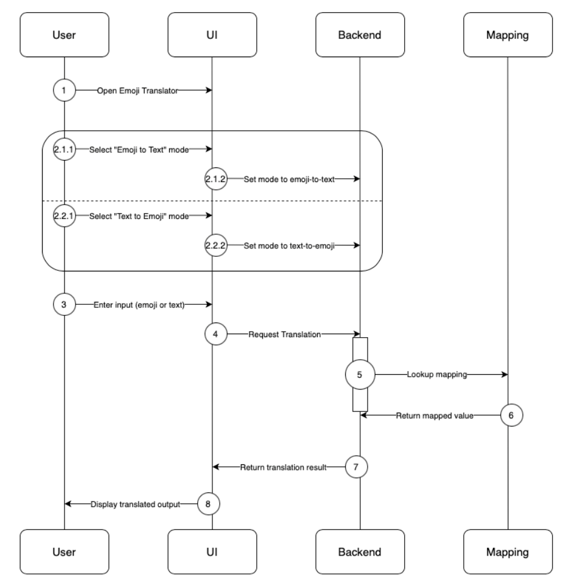

# Emoji-Text Translator Project Planning Document - Infinite Loopers
Team Members: Rhea Senthil Kumar, Emma Zhang, Gaurav Joshi, Win Htet Aung, Yuri Bukhradze, Braxton Conley, Jialuo Hu, Ethan Huang, Luting Lei, Sree Teja Nadella, Will Luo, Wayne Wang

## Project Background
This project aims to create a lightweight translation application that converts text into emojis and vice versa, functioning like a simplified version of Google Translate, but for emoji-based communication. The application will establish a one-to-one mapping between words and emojis, enabling direct, reversible translation. The goal of this project is to design a system that handles this translation reliably and efficiently, while also exploring the dynamics of teamwork through rapid, collaborative software development. While the project does not attempt to capture full semantic meaning or context, it provides a framework for building structured emoji-language representations and could serve as a foundation for more advanced, context-aware translation in the future.

## Stakeholders
- Development Team: As the creators, the team is the primary stakeholder, engaging in successfully completing building the application, meeting project requirements and deadlines, gaining practical software development and teamwork experience.
- End Users: Potential users of the application who want a fun, simple, and effective tool for emoji-based communication. Their interest lies in the application’s usability and reliability, and the quality of translation. Their needs drive the feature requirements and usability decisions.
- Course Instructor: The course instructor has an interest in evaluating the team performance, ensuring learning objectives are met, and assessing quality of the deliverables.

## In Scope
- Frontend-only web app hosted on GitHub pages. No servers, no databases.
- Translation between English and emoji using a static dictionary.
- Public API: translate(text,mode). Returns a string.
- UI: 2 textareas (input/output), switch direction.
- Tokenization rules(v1): split on whitespace, case-insensitive work lookups. Trim common punctuation on work lookups.
- Quality bar: unit tests for core paths (toEmoji/toWord, unknown tokens)
- Privacy: no user log in or authentication, no input persistence, no analytics on user text, no PII handling

## Out of Scope
The project mainly focuses on direct conversion of words from a passage to emojis, and in its current state does not have the ability to understand the context of the words to suitably place emoji’s, such a task would require an LLM which could understand the text, its tone, context and suitably put the emojis.
Another thing is that people use emojis in sentences not only as replacement of words but also emphasise/highlight/hyphenate phrases, and that is not yet part of the current version of the program.
Also, the program does not fix spelling mistakes so if you write sed instead of sad, it will not convert it.

## User Stories
As a user who receives messages with emojis, I want to paste emojis into the translator and get English text back, so that I can understand the meaning of emojis.

As a casual user, I want to convert some words from my message into emojis, so that I can express myself in a more fun and playful way.

As a new user, I want the interface to be clean and simple, so that I can use the translator without needing instructions.

## Glossary
Emoji - A small digital image or icon used to express an idea, emotion, or object

Tokenization - The process of splitting input text into separate words

UI (User interface) - The visual components that allow users to interact

Unit Test - A small, automated test that verifies the functionality of a specific piece of code

PII - Personally Identifiable Information

## Functional Requirements
Text-to-emoji translation:
- Accepts user input in plain text, mapping each word to an emoji if available. If there is no word to emoji mapping for a word it should remain in plain text.

Emoji-to-text translation:
- Accepts user input as a mixture of plain text and emojis. Each emoji should be mapped to a plain text word from the dictionary.
  
One-to-one mapping:
- Each emoji is paired with a plain text word and vice versa to ensure translation is reversible.
- The dictionary can be expanded in for the addition of more translations.

User Interface:
- Provides a simple user interface for user input/output.

## System Requirements
**Platform**: Runs fully in the browser; no backend or database.

**Hosting**: Deployed on GitHub Pages.

**Environment**: Works on modern browsers (Chrome, Firefox, Edge, Safari).

**Languages**: HTML, CSS, JavaScript.

**Dependencies**: Uses a static JavaScript dictionary file for emoji–word mapping.

**Performance**: Should load quickly and respond instantly to translations.

**Privacy**: No user data is stored or sent anywhere.

## High-Level Sequence Diagram

## Implementation Components
The application consists of three modules that operate independently, but come together to form a single piece of software. The components are not meant to run independently as microservices or sub-applications; rather, they are integral components that were developed independently to create layers of abstraction.

The **frontend** is implemented using HTML/CSS and JavaScript, regulating the visible interactions of the user with the application. The HTML page defines the elements that convey to the user the interface elements and their purpose (for instance, headers highlighting the name of the application and the purpose of each text box and button on the page); the HTML tags are also used to record user inputs and interactions: two text boxes (one for Text and one for Emoji; at each given point, only the leftmost text box is active and used to record input, whereas the right text box is solely used for output), the reverse button to switch the active text box, and the behavior to automatically perform the translation on each keystroke, allowing for dynamic update without the need for a separate input from the user to initiate the translation.

The frontend relies minimally on the **backend**, which is implemented in JavaScript and exposes the key translation function, taking the input and the mode of translation (text to emoji, or vice versa) as two arguments. Without the backend module, the frontend is still able to render and show the user the interface, albeit without the translation functionality. The translation function in the backend makes use of the data dictionary, mapping each emoji to the associated word. If the translation dictionary is not constructed, the translation function will simply not convert the input to the desired output, allowing for a failsafe implementation.

The **translation dictionary** is implemented as a JSON mapping of emoji to their text value, allowing us to translate inputs at constant time.

## Testing Plan
Due to time constraints, testing targets only the emoji translation logic. Test cases include the following:
- Checking that emoji dictionary file loads
- Single emoji -> Single word
- Single word -> Single emoji
- Multi word -> Multi emoji
- Multi emoji -> Multi word
- Words w/o emoji mapping -> Word
- Mixed input (emoji + words) -> Translated words only
- Emoji w/o mapping -> N/A
  
The method used to test the code is through automation using Node.js and Jest. This includes a CI/CD workflow for the GitHub repository to automatically run these test cases upon push to any branch and upon creating a Pull Request. Tests must pass in order to merge PRs.

## Development Plan
**Team Structure:**
- Frontend: Responsible for the UI/UX design and implementation
- Backend: Responsible for the word-extraction and translation logic
- Data: Responsible for the emoji-english dictionary mapping for our project.
  
In addition to the development teams, there is another subteam:
- DevOps: Responsible for CI/CD pipeline and integration testing.
  
**Dev Process**
- Communication: All coordination is done through Slack for real-time communication and status updates.
- Version Control: GitHub is used for source control, issue tracking, and code review.
- Continuous Integration: GitHub Actions is used for automated testing and deployment of project updates.
  
**Sprint Cycles**
- Friday: Kickoff meeting to finalize design, set goals, and assign subteams.
- Sat–Mon: Subteams develop independently and update progress on Slack.
- Tuesday: Integrate all parts, test, and fix issues via GitHub Actions.
- Wednesday: Team review and demo preparation.
- Thursday: Deliver final demo and collect feedback.
  
**Tech Stack**
- Languages: JavaScript, HTML, CSS
- Data Storage: Simple dictionary-based data structures (no external database)
